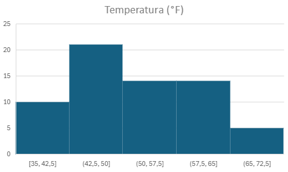
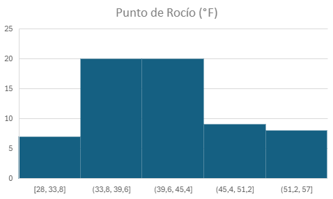
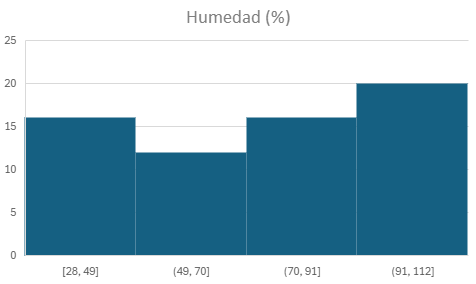
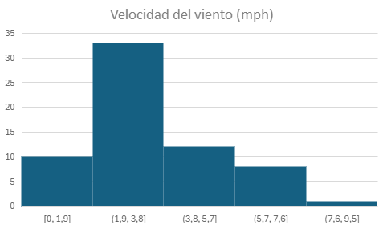
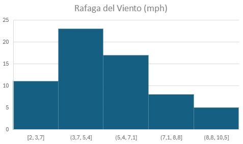
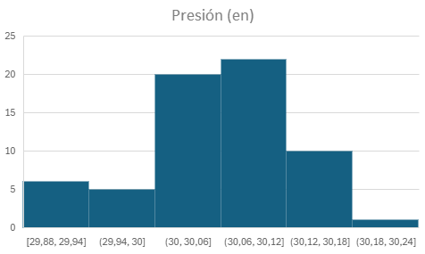
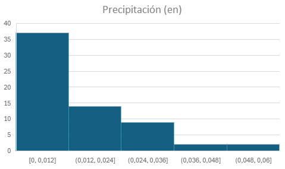
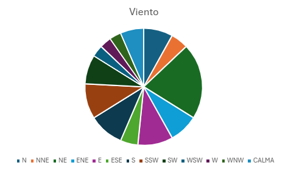
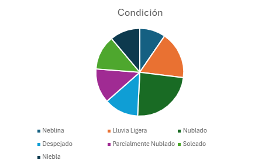

# Análisis e Interpretación de las Gráficas

## Histograma Temperatura

**Descripción:**

El histograma presentado representa la distribución de las temperaturas (en grados Fahrenheit, °F) observadas durante un periodo específico. Se divide en cinco intervalos de temperatura: [35, 42.5), [42.5, 50), [50, 57.5), [57.5, 65) y [65, 72.5), donde cada barra refleja la frecuencia con la que las temperaturas se registraron dentro de esos rangos. La altura de cada barra indica la cantidad de observaciones para cada intervalo, lo que permite visualizar cómo se distribuye la temperatura en el periodo analizado.

**Interpretación:**

El histograma refleja que las temperaturas moderadas son predominantes en el periodo analizado. En particular:

- El intervalo de [42.5°F, 50°F) presenta la mayor frecuencia, lo que sugiere que esta fue la temperatura más común durante el periodo, con aproximadamente 22 ocurrencias.
- Las temperaturas más altas, en el intervalo de [65°F, 72.5°F), fueron las menos frecuentes, ocurriendo solo 5 veces, lo que indica que temperaturas cálidas son inusuales en este periodo.
- Los datos parecen estar distribuidos de manera ligeramente asimétrica, con una tendencia hacia temperaturas más bajas, dado que los intervalos iniciales tienen frecuencias altas en comparación con los últimos.
- El rango de temperaturas analizado varía desde 35°F hasta 72.5°F, lo que muestra una moderada variabilidad climática.

## Histograma Punto de rocío 

**Descripción:**

El histograma representa la distribución del punto de rocío (en grados Fahrenheit, °F) durante un periodo específico. Los datos se agrupan en cinco intervalos: [28, 33.8), [33.8, 39.6), [39.6, 45.4), [45.4, 51.2) y [51.2, 57), con cada barra indicando la frecuencia de observaciones dentro de cada intervalo. La altura de las barras refleja cuántos registros del punto de rocío se encuentran en cada rango.

**Interpretación:**

El histograma muestra lo siguiente sobre la distribución del punto de rocío:

- Los intervalos [33.8°F, 39.6°F) y [39.6°F, 45.4°F) presentan las frecuencias más altas, ambas con aproximadamente 20 observaciones, lo que sugiere que estos valores de punto de rocío son los más comunes en el periodo analizado.
- El intervalo más bajo, [28°F, 33.8°F), y el más alto, [51.2°F, 57°F), tienen las menores frecuencias, con menos de 5 observaciones cada uno, indicando que valores extremos de punto de rocío (muy bajos o altos) son poco frecuentes.
- Los datos están relativamente equilibrados, pero existe una concentración hacia valores intermedios (de 33.8°F a 45.4°F), lo que refleja condiciones de humedad moderadas durante el periodo.
- El rango total del punto de rocío oscila entre 28°F y 57°F, reflejando una variación moderada en las condiciones de saturación del aire.

## Histograma Humedad

**Descripción:**

El histograma representa la distribución de los valores de humedad relativa (%) durante el periodo del 21 al 28 de octubre en Beijing. Los datos están agrupados en cuatro intervalos: [28, 49), [49, 70), [70, 91) y [91, 112), donde cada barra refleja la frecuencia de observaciones dentro de cada rango. La altura de las barras indica el número de días o momentos en los que la humedad relativa se registró dentro de cada intervalo.

**Interpretación:**

El histograma muestra las siguientes características sobre la distribución de la humedad relativa:

- Los intervalos [28, 49) y [91, 112) tienen frecuencias más altas, sugiriendo que los valores de humedad en estos rangos son los más comunes durante el periodo analizado.
- El intervalo [49, 70) presenta la frecuencia más baja, indicando que hubo menos registros de humedad relativa en este rango.
- Existe una mayor concentración de valores extremos de humedad, tanto en los rangos bajos ([28, 49)) como en los altos ([91, 112)), lo que podría reflejar condiciones de clima variable o cambios significativos en las condiciones meteorológicas.
- El rango total de la humedad relativa oscila entre 28% y 112%, lo cual sugiere una variación considerable en los niveles de humedad durante el periodo analizado.

## Histograma Velocidad del Viento

**Descripción:**

El histograma representa la distribución de la velocidad del viento (en millas por hora, mph) durante el periodo analizado. Los datos están agrupados en cinco intervalos: [0, 1.9), [1.9, 3.8), [3.8, 5.7), [5.7, 7.6) y [7.6, 9.5). La altura de las barras refleja la frecuencia de las observaciones dentro de cada rango, indicando cuántas veces se registraron velocidades del viento en cada intervalo.

**Interpretación:**

El histograma muestra lo siguiente sobre la distribución de la velocidad del viento:

- El intervalo [1.9, 3.8) tiene la frecuencia más alta, con aproximadamente 35 observaciones, lo que indica que este rango de velocidad es el más común durante el periodo analizado.
- Los intervalos extremos ([0, 1.9) y [7.6, 9.5)) presentan las frecuencias más bajas, sugiriendo que las velocidades de viento muy bajas o muy altas son poco frecuentes.
- Hay una tendencia decreciente en la frecuencia conforme aumenta la velocidad del viento después del intervalo más frecuente ([1.9, 3.8)), lo que sugiere que las velocidades más altas son menos comunes.
- El rango total de velocidades del viento oscila entre 0 mph y 9.5 mph, indicando condiciones generalmente calmadas a moderadas en el periodo analizado.

## Histograma Ráfaga del Viento

**Descripción:**

El histograma representa la distribución de las ráfagas de viento (en millas por hora, mph) durante el periodo analizado. Los datos están organizados en cinco intervalos: [2, 3.7), [3.7, 5.4), [5.4, 7.1), [7.1, 8.8) y [8.8, 10.5). La altura de cada barra refleja la frecuencia con que se registraron ráfagas de viento en cada intervalo.

**Interpretación:**

El histograma revela lo siguiente acerca de la distribución de las ráfagas de viento:

- El intervalo [3.7, 5.4) tiene la mayor frecuencia, con alrededor de 23 observaciones, lo que indica que este rango de velocidades de ráfaga es el más común en el periodo analizado.
- Los intervalos extremos ([2, 3.7) y [8.8, 10.5)) tienen las frecuencias más bajas, lo que sugiere que ráfagas de viento muy bajas o muy altas son menos frecuentes.
- La frecuencia disminuye de manera progresiva conforme se avanza hacia intervalos más altos de velocidad de ráfaga, particularmente en los rangos [7.1, 8.8) y [8.8, 10.5), lo que indica que ráfagas fuertes son menos habituales.
- El rango total de las ráfagas de viento oscila entre 2 mph y 10.5 mph, reflejando una variabilidad moderada.

## Histograma Presión

**Descripción:**

El histograma representa la distribución de los valores de presión atmosférica (en inHg) registrados en Beijing durante el período del 21 al 28 de octubre. Los datos están agrupados en intervalos de presión: [29.88, 29.94), [29.94, 30), [30, 30.06), [30.06, 30.12), [30.12, 30.18) y [30.18, 30.24). Cada barra del histograma indica la frecuencia de observaciones de presión que se encuentran dentro de cada intervalo. La altura de las barras refleja el número de registros para cada rango de presión.

**Interpretación:**

El histograma muestra lo siguiente sobre la distribución de la presión atmosférica:

- El intervalo [30.06, 30.12) presenta la frecuencia más alta, con aproximadamente 22 observaciones, lo que indica que este rango de presión fue el más común durante el período analizado.
- Los intervalos [30.12, 30.18) y [30, 30.06) también tienen frecuencias relativamente altas, con alrededor de 15 a 20 observaciones cada uno, lo que refleja una concentración significativa de valores de presión en estos rangos.
- Los extremos [29.88, 29.94) y [30.18, 30.24) tienen las frecuencias más bajas, con menos de 5 observaciones cada uno, indicando que presiones muy bajas o muy altas fueron poco comunes.
- La distribución general está centrada en valores de presión cercanos a 30.06 inHg, lo que sugiere condiciones atmosféricas estables típicas de alta presión durante el periodo analizado.

## Histograma Precipitación

**Descripción:**

El histograma representa la distribución de la precipitación (en pulgadas) registrada en Beijing durante el período del 21 al 28 de octubre. Los datos se agrupan en intervalos de precipitación: [0, 0.012), (0.012, 0.024), (0.024, 0.036), (0.036, 0.048) y (0.048, 0.06). Cada barra del histograma indica la frecuencia de observaciones de precipitación dentro de cada rango, y la altura de las barras refleja el número de registros correspondientes.

**Interpretación:**

El histograma muestra lo siguiente sobre la distribución de la precipitación:

- El intervalo [0, 0.012) tiene la frecuencia más alta, con aproximadamente 40 observaciones, indicando que valores muy bajos o nulos de precipitación fueron los más comunes durante el período analizado.
- Los intervalos (0.012, 0.024) y (0.024, 0.036) tienen frecuencias significativamente menores, con alrededor de 15 y 10 observaciones respectivamente, lo que refleja una menor incidencia de precipitaciones ligeras.
- Los intervalos más altos, (0.036, 0.048) y (0.048, 0.06), tienen frecuencias muy bajas, con menos de 5 observaciones cada uno, sugiriendo que lluvias moderadas a intensas fueron poco frecuentes.
- La distribución general está sesgada hacia valores bajos, lo que sugiere condiciones predominantemente secas durante el periodo analizado. Esto podría indicar estabilidad climática y poca presencia de sistemas de precipitación significativos.

## Histograma Viento

**Descripción:**

El gráfico de pastel representa la distribución de las direcciones del viento registradas en Beijing durante el período del 21 al 28 de octubre. Cada sección del pastel representa una dirección del viento, con el tamaño de cada segmento proporcional a la frecuencia relativa (fri) de ocurrencia. Las direcciones consideradas son N, NNE, NE, ENE, E, ESE, S, SSW, SW, WSW, W, WNW, y la categoría "CALMA" (sin dirección definida).

**Interpretación:**

El gráfico de pastel muestra lo siguiente sobre la distribución de las direcciones del viento:

- La dirección predominante fue NE, que representa el 20.63% de las observaciones, indicando que esta dirección fue la más común durante el periodo analizado.
- Las direcciones E, S, y SSW tuvieron frecuencias intermedias, cada una representando aproximadamente el 9.52% del total, lo que señala una mayor diversidad en las direcciones del viento hacia el este y el sur.
- Las categorías CALMA y N también destacan con 6.35% y 7.94%, respectivamente, sugiriendo periodos de viento ligero o sin movimiento definido y vientos hacia el norte.
- Las direcciones menos frecuentes fueron WSW, W, y WNW, cada una con 3.17%, lo que sugiere que los vientos del oeste fueron poco comunes.

## Histograma Condición

**Descripción:**

El gráfico de pastel representa la distribución de las condiciones climáticas registradas en Beijing durante el período del 21 al 28 de octubre. Cada segmento del pastel corresponde a una categoría de condición climática, y su tamaño es proporcional a la frecuencia relativa (fri) de ocurrencia. Las categorías incluyen: Neblina, Lluvia Ligera, Nublado, Despejado, Parcialmente Nublado, Soleado y Niebla.

**Interpretación:**

El gráfico de pastel muestra lo siguiente sobre la distribución de las condiciones climáticas:

- La categoría más frecuente fue Nublado, que representa el 23.81% de las observaciones, indicando que los cielos mayormente cubiertos dominaron durante el periodo.
- Las condiciones de Lluvia Ligera tuvieron una presencia significativa, con un 17.46% del total, reflejando un número considerable de días lluviosos pero sin precipitaciones intensas.
- Las condiciones Despejado, Parcialmente Nublado y Soleado tienen una frecuencia relativa igual del 12.70% cada una, lo que sugiere una diversidad de condiciones con periodos alternados de cielos claros.
- Las categorías Neblina (9.52%) y Niebla (11.11%) también fueron frecuentes, señalando la presencia de condensación en la atmósfera que podría estar asociada con alta humedad en el área.